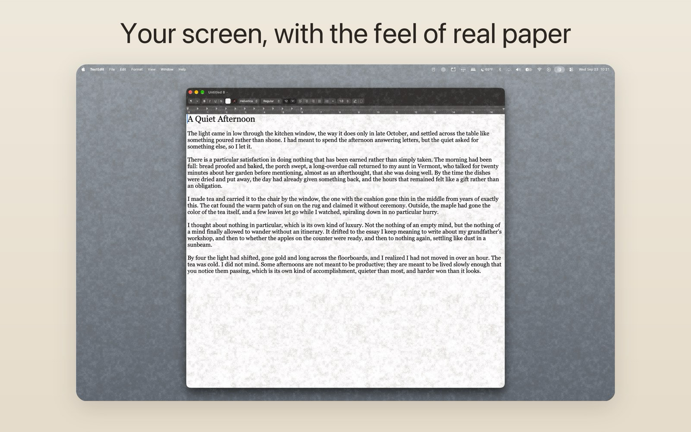

# Parchmatte

A quiet Mac menu-bar utility that lays a fine paper grain and an optional warm
Page Light tint over your screen, so a glossy display feels a little more like
a page. Clicks, scrolling and typing pass straight through: the apps
underneath never know it is there.

Made by **Galactic Luddite**.



## Get it

Parchmatte is free. All of it is in this repo, MIT licensed, and you can
[build it yourself](#build-it-yourself) in about five minutes. No catch.

**Or chip in $2.99 on the [Mac App Store](https://apps.apple.com/us/app/parchmatte/id6815385110?mt=12).** Parchmatte 1.0 went
on sale there on 2026-10-07 (macOS 13 or later). Think of it as a tip jar
that also gets you a signed build with automatic updates. Galactic Luddite apps
are made by one person with a lot of help from AI coding tools, and those
subscriptions aren't free. Buying the App Store version is what keeps them
paid and the next free app coming.

Same app either way. Pick whichever suits you.

More at [parchmatte.com](https://parchmatte.com).

## What it does

| Menu item | Hotkey | What it does |
|---|---|---|
| Paper Whole Screen | ⌃⌥O | Covers every enabled display. |
| Paper *App* Window | ⌃⌥P | Covers just the front window and follows it as it moves, resizes, switches tabs and goes full screen. Press again to remove. |
| Remove Window Papers (N) | | Removes every window cover. |
| **This Window — *App*** section | | Shown when the front window has its own cover. Strength, Softness, Texture and Page Light here change only that window's paper. A new window cover starts with the screen's style. |
| **Screen and New Windows** section | | The same controls for the whole screen and for window covers added from now on. |
| Strength slider | ⌃⌥↑ / ⌃⌥↓ | How strong the paper is. |
| Softness slider | ⌃⌥← / ⌃⌥→ | Takes the edge off the grain: 0% is crisp, higher is smoother and more velvety. |
| Texture | ⌃⌥T | Parchmatte, Fine Grain, Chalkboard, Woven, Imprint, Soft Leaf, Felt, Denim. The hotkey cycles. |
| Orientation | ⌃⌥I | Normal, Flipped Horizontally, Flipped Vertically, Flipped Both Ways: which way a directional grain such as Denim's twill runs. The hotkey cycles. |
| Page Light | ⌃⌥L | Off, Candlelight, Late Night, Reading Lamp, Golden Hour, Gallery, Aurora, plus Glow: Subtle / Medium / Warm. ⌃⌥L cycles the light; ⌃⌥G cycles the glow level (with the light off it only sets the level used next time). |
| Snooze | ⌃⌥S | 5 min, 15 min, 1 hour, 3 hours. The hotkey snoozes 15 minutes, or resumes. |
| Schedule | | Always, Sunset to Sunrise, Sunrise to Sunset, or Custom Hours. Sun times are estimated from your time zone; no location access. |
| Displays | | Turn the whole-screen cover on or off per display. |
| Excluded Apps | | Hide covers while a chosen app is in front, e.g. a photo editor. |
| Pause on Battery | | Turn covers off when unplugged. |
| Hide from Screenshots | | On by default: asks macOS to leave covers out of screenshots and screen sharing. Some newer capture tools may still show them. |
| Launch at Login | | Off by default. |

All the style hotkeys (⌃⌥↑↓←→, ⌃⌥T, ⌃⌥I, ⌃⌥L, ⌃⌥G) follow one rule: if the
window in front has its own cover, they change that cover; otherwise they
change the screen and new windows. Window covers, and their styles, last
until you remove them or quit.

Strength changes the paper while keeping your chosen Glow level steady. At
the strongest settings, Parchmatte automatically balances the paper and Page
Light so their combined opacity still stays within the 60% limit.

Parchmatte collects nothing and makes no network requests. See
[docs/PRIVACY.md](docs/PRIVACY.md).

## Build it yourself

You need macOS 13 or later and Apple's free developer tools.

1. **Install the tools** (skip this if you have Xcode):

   ```sh
   xcode-select --install
   ```

2. **Download the source:**

   ```sh
   git clone https://github.com/Galactic-Luddite/parchmatte.git
   cd parchmatte
   ```

3. **Build:**

   ```sh
   ./scripts/build.sh
   ```

   This produces `dist/Parchmatte.app`.

4. **Install and run:**

   ```sh
   mv dist/Parchmatte.app /Applications/
   open /Applications/Parchmatte.app
   ```

   The icon appears in your menu bar. An app you build on your own Mac opens
   normally. To run it on another Mac, build it there too: a copied build
   is not signed for that machine, and clicking past Gatekeeper's warning is
   a habit worth not learning.

### Optional: the Xcode project

The App Store build is described by `project.yml` for
[XcodeGen](https://github.com/yonaskolb/XcodeGen):

```sh
brew install xcodegen
xcodegen generate
open Parchmatte.xcodeproj
```

### Regenerating the art

Textures and the icon are drawn by code, with no third-party images:

```sh
python3 scripts/generate_textures.py   # Sources/Parchmatte/Textures/*.png
python3 scripts/generate_icon.py       # Resources/AppIcon-1024.png
./scripts/make_icons.sh                # icon sizes and AppIcon.icns (generated, not committed)
```

## How it works

Parchmatte draws its own borderless, transparent windows that ignore the mouse.
A whole-screen cover sits on each display above normal windows. A window
cover asks macOS where its target window is (public
`CGWindowListCopyWindowInfo`) about 60 times a second while it moves and 10
times a second at rest, then moves, resizes and restacks itself directly
above it. While the covered app is in front with other windows of its own,
it also checks the stacking about 45 times a second. Tracking stops while
covers are paused, snoozed or hidden. That constant catching-up is why a cover can trail
slightly while you drag a window. Global hotkeys use `RegisterEventHotKey`,
so no Accessibility permission is needed.

## License

MIT. See [LICENSE](LICENSE).

## Download

[](https://apps.apple.com/us/app/parchmatte/id6815385110?mt=12)
